# Лабораторная работа 1. Работа с сокетами

Выполнил Орельский Никита Сергеевич, группа K3339.

## Цель работы

Понять, как программы обмениваются данными через сокеты, и научиться строить клиент-серверное взаимодействие по протоколам UDP, TCP и HTTP.

## Общие сведения

Все программы написаны на Python 3 и используют только стандартную библиотеку. Работа проверена на Python 3.12 в macOS. Код лежит в папке `students/K3339/Orelskiy_Nikita/laboratory_work_1`, у каждого задания своя подпапка. Серверы слушают адрес `localhost`, каждому заданию отведён отдельный порт.

| Задание | Протокол | Порт | Файлы |
|---|---|---|---|
| 1. Обмен сообщениями | UDP | 8081 | `task1/server.py`, `task1/client.py` |
| 2. Квадратное уравнение | TCP | 8082 | `task2/server.py`, `task2/client.py` |
| 3. Раздача HTML-страницы | HTTP поверх TCP | 8083 | `task3/server.py`, `task3/index.html` |
| 4. Многопользовательский чат | TCP | 8084 | `task4/server.py`, `task4/client.py` |
| 5. Журнал оценок | HTTP поверх TCP | 8085 | `task5/server.py` |

Сервер каждого задания запускается в одном окне терминала, клиент в другом. Сервер работает до нажатия Ctrl+C. Снимки экрана в отчёте открываются в полном размере по щелчку.

## Задание 1. Обмен сообщениями по UDP

### Условие

Клиент отправляет серверу сообщение «Hello, server», и оно должно отобразиться на стороне сервера. В ответ сервер отправляет клиенту сообщение «Hello, client», которое должно отобразиться у клиента. Нужно использовать библиотеку `socket` и протокол UDP.

### Протокол обмена

UDP работает без установления соединения, поэтому весь обмен состоит из двух датаграмм. Клиент создаёт сокет типа `SOCK_DGRAM` и вызовом `sendto` отправляет на адрес `localhost:8081` строку `Hello, server` в кодировке UTF-8. Сервер привязан к этому порту и ждёт датаграмму в вызове `recvfrom`. Вместе с данными `recvfrom` возвращает адрес отправителя. Сервер печатает полученное сообщение и отправляет по этому адресу ответ `Hello, client`.

UDP не гарантирует доставку, и ответ может не прийти. Клиент ждёт его не дольше трёх секунд. Если ответа нет, клиент печатает «Сервер не отвечает» и завершает работу.

### Код

```python title="task1/server.py" linenums="1"
import socket

HOST = "localhost"
PORT = 8081
BUFFER_SIZE = 1024
REPLY = "Hello, client"


def main():
    server_socket = socket.socket(socket.AF_INET, socket.SOCK_DGRAM)
    try:
        server_socket.bind((HOST, PORT))
    except OSError as error:
        print(f"Не удалось занять порт {PORT}: {error}")
        server_socket.close()
        return
    print(f"UDP-сервер запущен на {HOST}:{PORT}")

    try:
        while True:
            try:
                data, client_address = server_socket.recvfrom(BUFFER_SIZE)
                message = data.decode("utf-8", errors="replace")
                sender = f"{client_address[0]}:{client_address[1]}"
                print(f"Сообщение от клиента {sender}: {message}")
                server_socket.sendto(REPLY.encode("utf-8"), client_address)
            except OSError as error:
                print(f"Ошибка обмена: {error}")
    except KeyboardInterrupt:
        print("\nСервер остановлен")
    finally:
        server_socket.close()


if __name__ == "__main__":
    main()
```

```python title="task1/client.py" linenums="1"
import socket

SERVER_ADDRESS = ("localhost", 8081)
BUFFER_SIZE = 1024
TIMEOUT = 3
MESSAGE = "Hello, server"


def main():
    client_socket = socket.socket(socket.AF_INET, socket.SOCK_DGRAM)
    client_socket.settimeout(TIMEOUT)

    try:
        client_socket.sendto(MESSAGE.encode("utf-8"), SERVER_ADDRESS)
        data, _ = client_socket.recvfrom(BUFFER_SIZE)
        answer = data.decode("utf-8", errors="replace")
        print(f"Ответ сервера: {answer}")
    except (socket.timeout, ConnectionResetError):
        print("Сервер не отвечает")
    finally:
        client_socket.close()


if __name__ == "__main__":
    main()
```

### Пример работы

В первом окне терминала запускается сервер командой `python3 server.py`, во втором клиент командой `python3 client.py`. Обе команды выполняются из папки `task1`. В окне сервера появляется сообщение клиента вместе с его адресом, клиент показывает ответ сервера.

[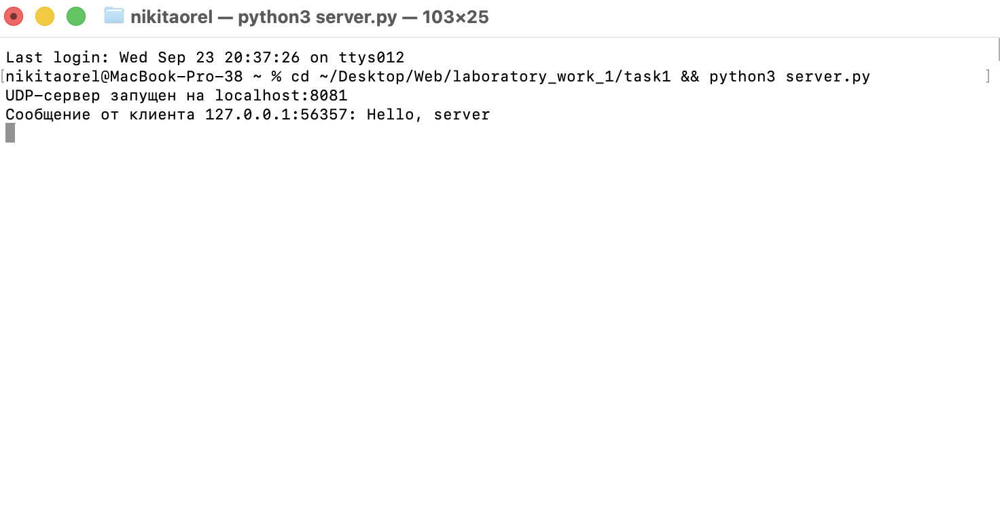](img/task1_server.png)

Рисунок 1. Окно сервера

[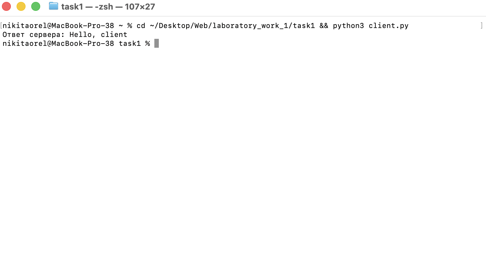](img/task1_client.png)

Рисунок 2. Окно клиента

## Задание 2. Решение квадратного уравнения по TCP

### Условие

Клиент запрашивает выполнение математической операции, параметры которой вводятся с клавиатуры. Сервер обрабатывает данные и возвращает результат клиенту. Нужно использовать библиотеку `socket` и протокол TCP. Операция выбирается по номеру в журнале. Вариантов четыре, они повторяются по кругу. Номеру 18 соответствует вариант 2, решение квадратного уравнения.

### Протокол обмена

TCP передаёт данные сплошным потоком байтов и границ сообщений не сохраняет. Границы задаёт сама программа. В работе одно сообщение занимает одну строку и заканчивается символом перевода строки. Кодировка сообщений UTF-8.

Клиент спрашивает у пользователя коэффициенты `a`, `b` и `c`, подключается к `localhost:8082` и отправляет одну строку с тремя числами через пробел, например `1 -3 2`. Дробную часть можно отделять точкой или запятой. Сервер читает строку, решает уравнение ax² + bx + c = 0 и отвечает одной строкой. После ответа соединение закрывается, следующий запрос идёт по новому соединению.

| Случай | Запрос | Ответ сервера |
|---|---|---|
| Дискриминант больше нуля | `1 -3 2` | `D = 1, x1 = 1, x2 = 2` |
| Дискриминант равен нулю | `1 2 1` | `D = 0, x = -1` |
| Дискриминант меньше нуля | `1 0 1` | `D = -4, действительных корней нет` |
| Коэффициент `a` равен нулю | `0 2 1` | `Ошибка: коэффициент a не должен быть равен нулю` |
| Чисел не три | `1 2` | `Ошибка: нужно передать три числа` |
| Значение не является числом | `1 x 2` | `Ошибка: коэффициенты должны быть числами в десятичной записи` |

Сервер также отклоняет с текстом ошибки число длиннее 30 символов и сообщение, которое вместе с переводом строки занимает больше 200 символов.

Сервер переводит коэффициенты в обыкновенные дроби `Fraction`, поэтому дискриминант вычисляется точно, без ошибок округления. В ответе дискриминант и корни выводятся с точностью до десяти значащих цифр.

Сервер закрывает соединение, если клиент молчит дольше трёх секунд. Клиент прекращает ожидание, если сервер молчит дольше пяти секунд. Клиентов сервер обслуживает по очереди.

### Код

```python title="task2/server.py" linenums="1"
import math
import socket
from fractions import Fraction

HOST = "localhost"
PORT = 8082
ENCODING = "utf-8"
TIMEOUT = 3
MAX_MESSAGE_LENGTH = 200
MAX_NUMBER_LENGTH = 30
NOT_A_NUMBER = "коэффициенты должны быть числами в десятичной записи"


def format_number(value):
    if value == 0:
        value = 0.0
    return f"{value:.10g}"


def parse_number(text):
    digits = text.lstrip("+-").replace(".", "", 1)
    if not digits.isdecimal():
        raise ValueError(NOT_A_NUMBER)
    if len(text) > MAX_NUMBER_LENGTH:
        raise ValueError(f"число должно быть не длиннее {MAX_NUMBER_LENGTH} символов")
    try:
        return Fraction(text)
    except ValueError:
        raise ValueError(NOT_A_NUMBER) from None


def parse_coefficients(text):
    parts = text.replace(",", ".").split()
    if len(parts) != 3:
        raise ValueError("нужно передать три числа")
    return [parse_number(part) for part in parts]


def solve_quadratic(a, b, c):
    if a == 0:
        raise ValueError("коэффициент a не должен быть равен нулю")

    discriminant = b * b - 4 * a * c
    d_text = format_number(float(discriminant))
    if discriminant < 0:
        return f"D = {d_text}, действительных корней нет"
    if discriminant == 0:
        x = float(-b / (2 * a))
        return f"D = 0, x = {format_number(x)}"

    root = math.sqrt(discriminant)
    q = -(float(b) + math.copysign(root, b)) / 2
    x1 = q / float(a)
    x2 = float(c) / q
    if x1 > x2:
        x1, x2 = x2, x1
    return f"D = {d_text}, x1 = {format_number(x1)}, x2 = {format_number(x2)}"


def build_answer(text):
    try:
        a, b, c = parse_coefficients(text)
        return solve_quadratic(a, b, c)
    except ValueError as error:
        return f"Ошибка: {error}"


def handle_client(connection, client_address):
    connection.settimeout(TIMEOUT)
    print(f"Подключился клиент {client_address[0]}:{client_address[1]}")
    with connection.makefile("r", encoding=ENCODING, errors="replace") as reader:
        line = reader.readline(MAX_MESSAGE_LENGTH + 1)
    if not line:
        print("Клиент отключился, не прислав данные")
        return
    if len(line) > MAX_MESSAGE_LENGTH:
        answer = "Ошибка: сообщение слишком длинное"
    else:
        print(f"Получены коэффициенты: {line.strip()}")
        answer = build_answer(line)
    connection.sendall((answer + "\n").encode(ENCODING))
    print(f"Отправлен ответ: {answer}")


def main():
    server_socket = socket.socket(socket.AF_INET, socket.SOCK_STREAM)
    server_socket.setsockopt(socket.SOL_SOCKET, socket.SO_REUSEADDR, 1)
    try:
        server_socket.bind((HOST, PORT))
    except OSError as error:
        print(f"Не удалось занять порт {PORT}: {error}")
        server_socket.close()
        return
    server_socket.listen(5)
    print(f"TCP-сервер запущен на {HOST}:{PORT}")

    try:
        while True:
            try:
                connection, client_address = server_socket.accept()
                with connection:
                    handle_client(connection, client_address)
            except OSError as error:
                print(f"Ошибка соединения: {error}")
    except KeyboardInterrupt:
        print("\nСервер остановлен")
    finally:
        server_socket.close()


if __name__ == "__main__":
    main()
```

```python title="task2/client.py" linenums="1"
import socket

SERVER_ADDRESS = ("localhost", 8082)
ENCODING = "utf-8"
TIMEOUT = 5


def ask_server(message):
    client_socket = socket.socket(socket.AF_INET, socket.SOCK_STREAM)
    client_socket.settimeout(TIMEOUT)
    try:
        client_socket.connect(SERVER_ADDRESS)
        client_socket.sendall((message + "\n").encode(ENCODING, errors="replace"))
        with client_socket.makefile("r", encoding=ENCODING, errors="replace") as reader:
            return reader.readline().strip()
    except OSError:
        return ""
    finally:
        client_socket.close()


def main():
    print("Решение квадратного уравнения ax^2 + bx + c = 0")
    a = input("Введите a: ")
    b = input("Введите b: ")
    c = input("Введите c: ")

    answer = ask_server(f"{a} {b} {c}")
    if answer:
        print(f"Ответ сервера: {answer}")
    else:
        print("Не удалось получить ответ сервера")


if __name__ == "__main__":
    try:
        main()
    except (KeyboardInterrupt, EOFError):
        print("\nВвод прерван")
```

### Пример работы

Сервер запускается из папки `task2` командой `python3 server.py`, клиент командой `python3 client.py`. На рисунках клиент запущен три раза. В первом запуске у уравнения два корня, во втором один корень, в третьем коэффициент `a` равен нулю, и сервер возвращает сообщение об ошибке.

[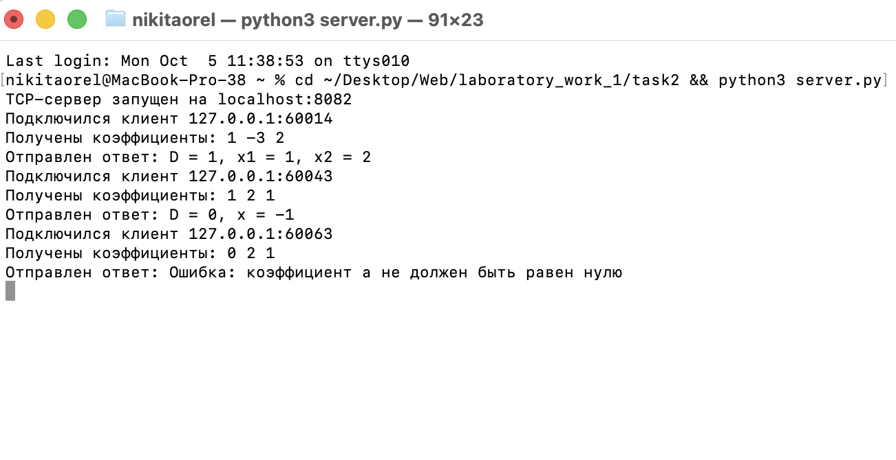](img/task2_server.png)

Рисунок 3. Окно сервера с тремя запросами

[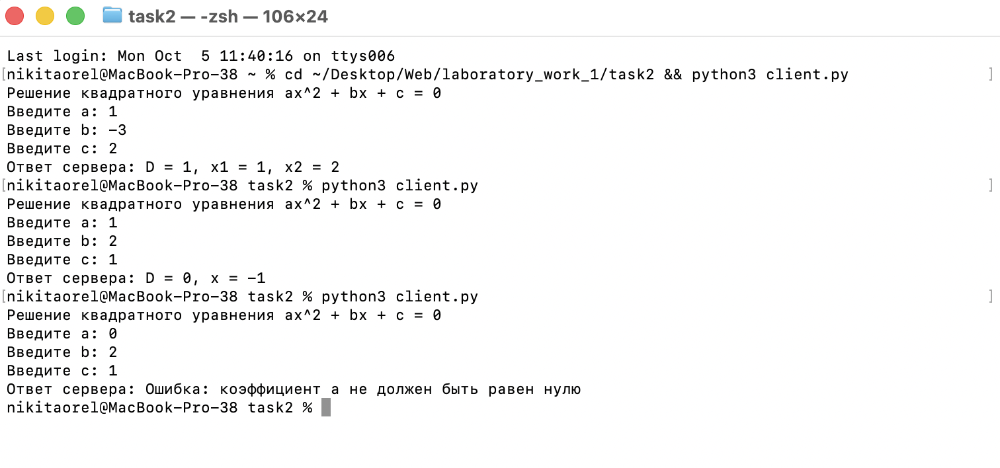](img/task2_client.png)

Рисунок 4. Три запуска клиента

## Задание 3. Раздача HTML-страницы по HTTP

### Условие

Нужно реализовать серверную часть приложения. Клиент подключается к серверу и в ответ получает HTTP-сообщение с HTML-страницей, которую сервер загружает из файла `index.html`. Нужно использовать библиотеку `socket`.

### Протокол обмена

Сервер слушает порт 8083 и отвечает по протоколу HTTP версии 1.1, который работает поверх TCP. Клиентом может быть браузер или утилита `curl`.

После подключения сервер читает запрос до пустой строки, которой заканчиваются заголовки. Первую строку запроса он печатает в консоль. Путь из запроса сервер не разбирает и на любой запрос отвечает одной и той же страницей. Условие требует только отдать страницу из файла `index.html`. Выбор действия по методу и пути появляется в задании 5.

Ответ состоит из строки статуса, заголовков, пустой строки и тела. Телом служит содержимое файла `index.html`.

```http
HTTP/1.1 200 OK
Content-Type: text/html; charset=utf-8
Content-Length: 1251
Connection: close

<!DOCTYPE html>
<html lang="ru">
```

Заголовок `Content-Length` содержит длину тела в байтах. Сервер читает файл в двоичном виде и берёт длину прочитанных данных. Длина в символах здесь не подходит, потому что русская буква в UTF-8 занимает два байта. Заголовок `Connection: close` сообщает клиенту, что после ответа сервер закроет соединение.

Файл читается с диска при каждом запросе. Страницу можно менять без перезапуска сервера. Если файла `index.html` рядом с сервером нет, сервер отвечает статусом `404 Not Found` и короткой страницей с сообщением об ошибке.

### Код

```python title="task3/server.py" linenums="1"
import socket
from pathlib import Path

HOST = "localhost"
PORT = 8083
BUFFER_SIZE = 1024
MAX_REQUEST_SIZE = 65536
TIMEOUT = 2
HEADERS_END = b"\r\n\r\n"
PAGE_PATH = Path(__file__).resolve().parent / "index.html"
NOT_FOUND_PAGE = "<h1>404 Not Found</h1><p>Файл index.html не найден</p>"


def read_request(connection):
    data = b""
    try:
        while HEADERS_END not in data and len(data) < MAX_REQUEST_SIZE:
            chunk = connection.recv(BUFFER_SIZE)
            if not chunk:
                break
            data += chunk
    except socket.timeout:
        pass
    return data.decode("utf-8", errors="replace")


def load_page():
    try:
        return "200 OK", PAGE_PATH.read_bytes()
    except OSError:
        return "404 Not Found", NOT_FOUND_PAGE.encode("utf-8")


def build_response(status, body):
    headers = [
        f"HTTP/1.1 {status}",
        "Content-Type: text/html; charset=utf-8",
        f"Content-Length: {len(body)}",
        "Connection: close",
    ]
    head = "\r\n".join(headers) + "\r\n\r\n"
    return head.encode("utf-8") + body


def handle_client(connection, client_address):
    connection.settimeout(TIMEOUT)
    request = read_request(connection)
    if not request.strip():
        return
    request_line = request.splitlines()[0]
    print(f"Запрос от {client_address[0]}:{client_address[1]}: {request_line}")
    status, body = load_page()
    connection.sendall(build_response(status, body))
    print(f"Ответ: {status}, тело {len(body)} байт")


def main():
    server_socket = socket.socket(socket.AF_INET, socket.SOCK_STREAM)
    server_socket.setsockopt(socket.SOL_SOCKET, socket.SO_REUSEADDR, 1)
    try:
        server_socket.bind((HOST, PORT))
    except OSError as error:
        print(f"Не удалось занять порт {PORT}: {error}")
        server_socket.close()
        return
    server_socket.listen(5)
    print(f"HTTP-сервер запущен, откройте http://{HOST}:{PORT}")

    try:
        while True:
            try:
                connection, client_address = server_socket.accept()
                with connection:
                    handle_client(connection, client_address)
            except OSError as error:
                print(f"Ошибка соединения: {error}")
    except KeyboardInterrupt:
        print("\nСервер остановлен")
    finally:
        server_socket.close()


if __name__ == "__main__":
    main()
```

```html title="task3/index.html" linenums="1"
<!DOCTYPE html>
<html lang="ru">
<head>
    <meta charset="utf-8">
    <meta name="viewport" content="width=device-width, initial-scale=1">
    <title>Лабораторная работа 1</title>
    <style>
        body {
            font-family: Arial, sans-serif;
            max-width: 720px;
            margin: 40px auto;
            padding: 0 20px;
            line-height: 1.5;
            color: black;
            background-color: whitesmoke;
        }
        h1 {
            color: darkslateblue;
        }
        .card {
            padding: 16px 24px;
            border: 1px solid lightgray;
            border-radius: 8px;
            background-color: white;
        }
    </style>
</head>
<body>
    <h1>Лабораторная работа 1. Работа с сокетами</h1>
    <div class="card">
        <p>Эту страницу отдал HTTP-сервер, написанный на Python с помощью библиотеки socket.</p>
        <p>Сервер читает файл index.html с диска и отправляет его содержимое внутри HTTP-ответа.</p>
        <p>Выполнил Орельский Никита, группа K3339.</p>
    </div>
</body>
</html>
```

### Пример работы

В папке `task3` выполняется команда `python3 server.py`. Ответ сервера вместе с заголовками показывает утилита `curl`.

```bash
curl -s -i http://localhost:8083/ | head -n 12
```

[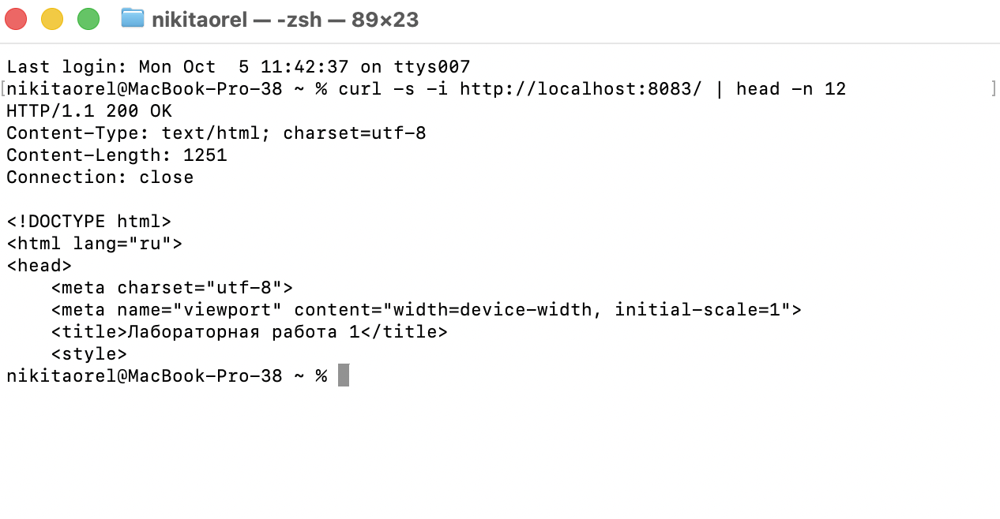](img/task3_curl.png)

Рисунок 5. Ответ сервера на запрос из curl

[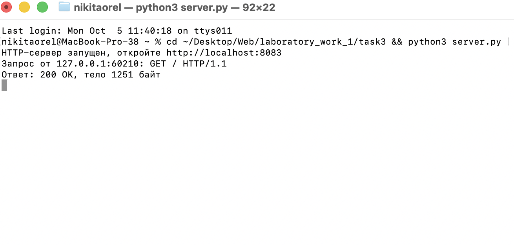](img/task3_server.png)

Рисунок 6. Запрос и ответ в окне сервера

В браузере по адресу `http://localhost:8083` открывается страница из файла `index.html`.

[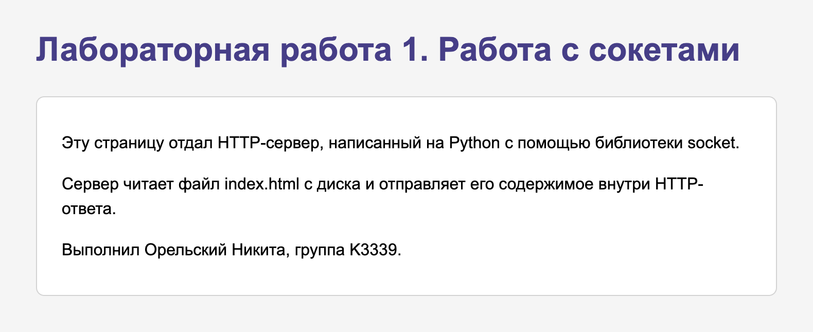](img/task3_browser.png)

Рисунок 7. Страница в браузере по адресу http://localhost:8083

## Задание 4. Многопользовательский чат

### Условие

Нужно реализовать двухпользовательский или многопользовательский чат. В работе сделан многопользовательский вариант на TCP, для него обязательны библиотеки `socket` и `threading`. Участники должны различаться между собой, и у каждого должна быть возможность выйти из чата. Клиентский скрипт один для всех участников.

### Протокол обмена

Чат работает по TCP на порту 8084. Сервер и клиенты обмениваются текстовыми строками в кодировке UTF-8, каждое сообщение занимает одну строку.

Сразу после подключения клиент отправляет имя участника. Сервер принимает имя, если оно непустое, не длиннее 20 символов, состоит только из букв и цифр и не занято другим участником. На подходящее имя сервер отвечает строкой `OK` и следом присылает список тех, кто уже в чате. Если в чате ещё никого нет, вместо списка приходит строка об этом. При отказе сервер присылает причину, клиент показывает её и спрашивает имя заново.

Каждую следующую строку участника сервер рассылает всем остальным и добавляет перед текстом имя автора в квадратных скобках. Самому автору его сообщение не возвращается. Служебные строки о входе и выходе участников начинаются со звёздочки.

Для выхода участник вводит команду `/exit`. Клиент передаёт её серверу и закрывает соединение. Сервер удаляет участника из списка и сообщает остальным о его выходе. Так же сервер поступает при обрыве соединения.

| Кто отправляет | Пример строки | Назначение |
|---|---|---|
| Клиент | `Никита` | имя при входе |
| Сервер новому участнику | `OK` | имя принято |
| Сервер новому участнику | `Это имя уже занято` | отказ с причиной |
| Сервер новому участнику | `* Сейчас в чате: Никита, Анна` | кто уже в чате |
| Сервер новому участнику | `* Кроме вас в чате пока никого нет` | в чате пока никого нет |
| Сервер остальным участникам | `* Пользователь Макс вошёл в чат` | вход участника |
| Клиент | `Всем привет` | сообщение |
| Сервер остальным участникам | `[Никита] Всем привет` | сообщение с именем автора |
| Клиент | `/exit` | выход из чата |
| Сервер остальным участникам | `* Пользователь Макс вышел из чата` | выход участника |

### Потоки

Сервер принимает подключения в главном потоке и для каждого клиента запускает отдельный поток с функцией `handle_client`. Благодаря этому сервер одновременно ждёт сообщения от всех участников. Участники хранятся в словаре `clients`. Ключом в нём служит сокет клиента, значением имя участника. Словарь общий для всех потоков, поэтому проверка имени, добавление, удаление и рассылка выполняются под блокировкой `clients_lock`.

В клиенте два потока. Главный поток читает строки с клавиатуры и отправляет их серверу. Второй поток принимает строки от сервера и печатает их. Чужие сообщения появляются сразу, без ожидания ввода.

Клиентский скрипт один. Каждый участник запускает `client.py` в своём окне терминала и вводит имя с клавиатуры.

### Код

```python title="task4/server.py" linenums="1"
import socket
import threading
import time

HOST = "localhost"
PORT = 8084
ENCODING = "utf-8"
MAX_NAME_LENGTH = 20
MAX_LINE_LENGTH = 4096
JOIN_TIMEOUT = 2
EXIT_COMMAND = "/exit"

clients = {}
clients_lock = threading.Lock()
connections = set()
connections_lock = threading.Lock()
stopping = threading.Event()


def send_line(connection, text):
    connection.sendall((text + "\n").encode(ENCODING, errors="replace"))


def read_line(reader):
    line = reader.readline(MAX_LINE_LENGTH + 1)
    if len(line) > MAX_LINE_LENGTH:
        return ""
    return line


def broadcast(text, sender=None):
    with clients_lock:
        print(text)
        for connection in clients:
            if connection is sender:
                continue
            try:
                send_line(connection, text)
            except OSError:
                pass


def check_name(name):
    if not name:
        return "Имя не должно быть пустым"
    if len(name) > MAX_NAME_LENGTH:
        return f"Имя должно быть не длиннее {MAX_NAME_LENGTH} символов"
    if not name.isalnum():
        return "В имени допустимы только буквы и цифры"
    return None


def register(connection, reader, address):
    while True:
        line = read_line(reader)
        if not line:
            return None
        name = line.strip()
        problem = check_name(name)
        if problem is None:
            with clients_lock:
                if name not in clients.values():
                    others = ", ".join(clients.values())
                    send_line(connection, "OK")
                    if others:
                        send_line(connection, f"* Сейчас в чате: {others}")
                    else:
                        send_line(connection, "* Кроме вас в чате пока никого нет")
                    clients[connection] = name
                    print(f"Пользователь {name} подключился с адреса {address}")
                    return name
            problem = "Это имя уже занято"
        send_line(connection, problem)


def handle_client(connection, client_address):
    address = f"{client_address[0]}:{client_address[1]}"
    reader = connection.makefile("r", encoding=ENCODING, errors="replace", newline="\n")
    with connection, reader:
        try:
            name = register(connection, reader, address)
            if name is None:
                return
            broadcast(f"* Пользователь {name} вошёл в чат", sender=connection)
            while not stopping.is_set():
                line = read_line(reader)
                if not line:
                    break
                text = line.strip()
                if text == EXIT_COMMAND:
                    break
                if text:
                    broadcast(f"[{name}] {text}", sender=connection)
        except OSError:
            pass
        finally:
            with clients_lock:
                left_name = clients.pop(connection, None)
            if left_name is not None and not stopping.is_set():
                broadcast(f"* Пользователь {left_name} вышел из чата")
            with connections_lock:
                connections.discard(connection)


def close_all_connections():
    with connections_lock:
        open_connections = list(connections)
    for connection in open_connections:
        try:
            connection.shutdown(socket.SHUT_RDWR)
        except OSError:
            pass


def wait_for_threads():
    deadline = time.monotonic() + JOIN_TIMEOUT
    for thread in threading.enumerate():
        if thread is not threading.current_thread():
            thread.join(max(0, deadline - time.monotonic()))


def main():
    server_socket = socket.socket(socket.AF_INET, socket.SOCK_STREAM)
    server_socket.setsockopt(socket.SOL_SOCKET, socket.SO_REUSEADDR, 1)
    try:
        server_socket.bind((HOST, PORT))
    except OSError as error:
        print(f"Не удалось занять порт {PORT}: {error}")
        server_socket.close()
        return
    server_socket.listen()
    print(f"Чат-сервер запущен на {HOST}:{PORT}")

    try:
        while True:
            try:
                connection, client_address = server_socket.accept()
            except OSError as error:
                print(f"Не удалось принять подключение: {error}")
                time.sleep(0.5)
                continue
            with connections_lock:
                connections.add(connection)
            thread = threading.Thread(
                target=handle_client, args=(connection, client_address), daemon=True
            )
            thread.start()
    except KeyboardInterrupt:
        print("\nСервер остановлен")
    finally:
        stopping.set()
        server_socket.close()
        close_all_connections()
        wait_for_threads()


if __name__ == "__main__":
    main()
```

```python title="task4/client.py" linenums="1"
import socket
import sys
import threading

SERVER_ADDRESS = ("localhost", 8084)
ENCODING = "utf-8"
JOIN_TIMEOUT = 2
EXIT_COMMAND = "/exit"


def send_line(connection, text):
    connection.sendall((text + "\n").encode(ENCODING, errors="replace"))


def read_line(prompt=""):
    if prompt:
        print(prompt, end="", flush=True)
    line = sys.stdin.readline()
    if not line:
        raise EOFError
    return line.strip()


def register(connection, reader):
    while True:
        name = read_line("Введите имя: ")
        if name == EXIT_COMMAND:
            return None
        send_line(connection, name)
        reply = reader.readline().strip()
        if reply == "OK":
            return name
        if not reply:
            print("Сервер закрыл соединение")
            return None
        print(reply)


def receive_messages(reader, stopped):
    try:
        for line in reader:
            if stopped.is_set():
                break
            print(line.rstrip("\n"))
    except (OSError, ValueError):
        pass
    if not stopped.is_set():
        stopped.set()
        print("Соединение с сервером закрыто, нажмите Enter для выхода")


def chat(connection, stopped):
    while not stopped.is_set():
        text = read_line()
        if stopped.is_set():
            break
        if text == EXIT_COMMAND:
            stopped.set()
            send_line(connection, EXIT_COMMAND)
            break
        if text:
            send_line(connection, text)


def main():
    connection = socket.socket(socket.AF_INET, socket.SOCK_STREAM)
    try:
        connection.connect(SERVER_ADDRESS)
    except OSError:
        print("Не удалось подключиться к серверу")
        connection.close()
        return

    reader = connection.makefile("r", encoding=ENCODING, errors="replace", newline="\n")
    stopped = threading.Event()
    receiver = threading.Thread(
        target=receive_messages, args=(reader, stopped), daemon=True
    )
    joined = False
    try:
        name = register(connection, reader)
        if name is None:
            return
        print(f"Вы вошли в чат как {name}. Для выхода введите {EXIT_COMMAND}")
        joined = True
        receiver.start()
        chat(connection, stopped)
    except (KeyboardInterrupt, EOFError):
        stopped.set()
        print()
    except OSError:
        print("Соединение с сервером потеряно")
    finally:
        stopped.set()
        try:
            connection.shutdown(socket.SHUT_RDWR)
        except OSError:
            pass
        if receiver.is_alive():
            receiver.join(JOIN_TIMEOUT)
        connection.close()
        if joined:
            print("Вы вышли из чата")


if __name__ == "__main__":
    main()
```

### Пример работы

Для чата в папке `task4` выполняется та же команда `python3 server.py`, каждый участник запускает `python3 client.py` в отдельном окне. В примере три участника. Третий сначала вводит занятое имя Никита, получает отказ и входит под именем Макс. Никита и Анна обмениваются сообщениями, после этого Макс выходит командой `/exit`.

[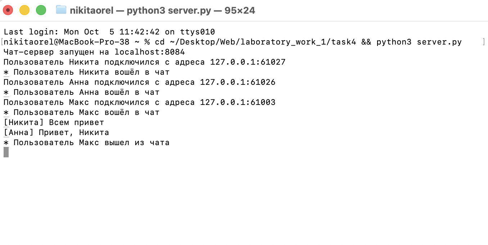](img/task4_server.png)

Рисунок 8. Окно сервера

[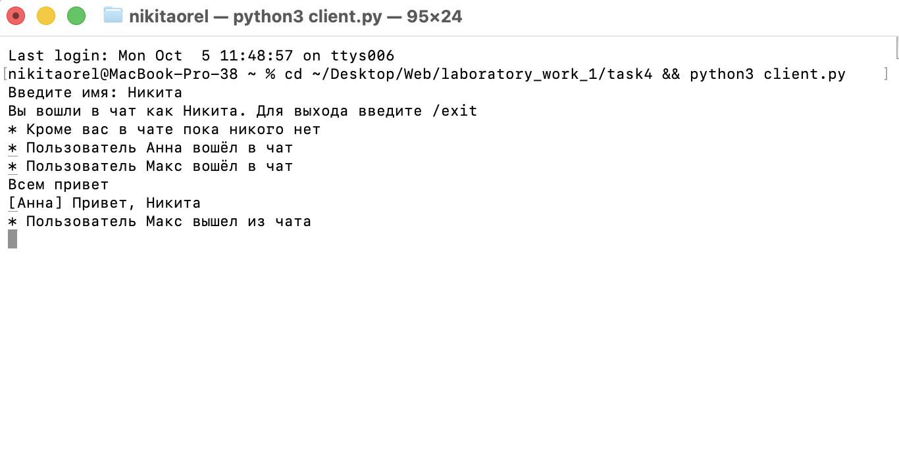](img/task4_client_1.png)

Рисунок 9. Участник Никита

[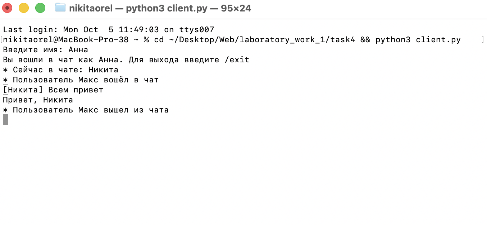](img/task4_client_2.png)

Рисунок 10. Участник Анна

[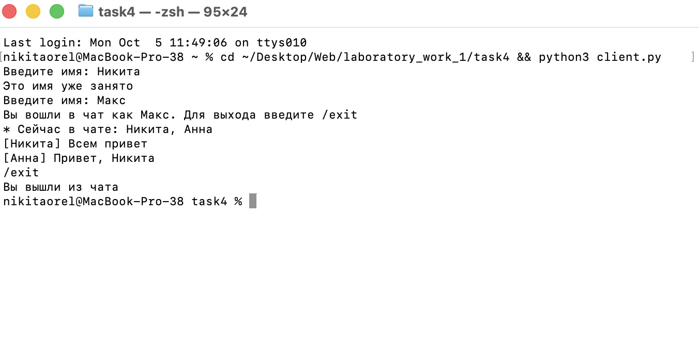](img/task4_client_3.png)

Рисунок 11. Участник Макс, отказ по занятому имени и выход из чата

## Задание 5. Веб-сервер с журналом оценок

### Условие

Нужно написать веб-сервер, который обрабатывает запросы GET и POST с помощью библиотеки `socket`. Сервер принимает и записывает дисциплину и оценку по ней и отдаёт все оценки в виде HTML-страницы. Журнал группируется по предмету. Две оценки по одной дисциплине должны дать одну запись с названием и списком из двух оценок.

### Протокол обмена

Сервер слушает порт 8085 и разбирает HTTP-запросы вручную. Из первой строки он берёт метод и путь, затем читает заголовки до пустой строки. У запроса POST сервер читает ещё и тело, длина которого указана в заголовке `Content-Length`.

Сервер обслуживает один путь `/` и два метода.

| Запрос | Действие сервера | Ответ |
|---|---|---|
| `GET /` | собирает страницу с формой и таблицей оценок | `200 OK` и HTML-страница |
| `POST /` | записывает оценку из полей `discipline` и `grade` | `303 See Other` и переадресация на `/` |

Форма на странице отправляет поля в теле запроса в формате `application/x-www-form-urlencoded`. В сокращённом виде запрос на добавление оценки 4 по физике выглядит так.

```http
POST / HTTP/1.1
Host: localhost:8085
Content-Type: application/x-www-form-urlencoded
Content-Length: 55

discipline=%D0%A4%D0%B8%D0%B7%D0%B8%D0%BA%D0%B0&grade=4
```

Получив ответ `303 See Other`, браузер сам запрашивает адрес из заголовка `Location` и показывает обновлённую таблицу. При таком порядке обновление страницы не отправляет форму повторно.

На ошибочный запрос сервер отвечает страницей с описанием ошибки и соответствующим статусом.

| Ситуация | Статус |
|---|---|
| Неверная первая строка или заголовок запроса | `400 Bad Request` |
| Не указана дисциплина или оценка не входит в диапазон от 1 до 5 | `400 Bad Request` |
| Путь отличается от `/` | `404 Not Found` |
| Метод отличается от GET и POST | `405 Method Not Allowed` |
| После первой строки запроса клиент молчит дольше двух секунд | `408 Request Timeout` |
| Тело POST передано не в формате формы | `415 Unsupported Media Type` |

Соединение, по которому клиент замолчал на две секунды, не дослав первую строку запроса, сервер закрывает без ответа.

### Хранение оценок

Журнал хранится в словаре `journal`. Ключом служит название дисциплины, приведённое к одному регистру методом `casefold`, поэтому «Математика» и «математика» считаются одной дисциплиной. Значение содержит название в том виде, в каком его ввели первый раз, и список оценок. Новая оценка по уже известной дисциплине добавляется в её список, отдельная запись для неё не создаётся. В таблице на странице каждой дисциплине соответствует одна строка со всеми её оценками.

Журнал находится в памяти процесса и после перезапуска сервера пуст. Перед вставкой в HTML название дисциплины обрабатывается функцией `html.escape`, поэтому введённые теги выводятся как обычный текст.

### Устройство сервера

Сервер оформлен классом `MyHTTPServer` по образцу базового класса из задания.

| Метод | Назначение |
|---|---|
| `serve_forever` | создаёт слушающий сокет и в цикле принимает подключения |
| `serve_client` | обслуживает одно подключение от разбора запроса до отправки ответа |
| `parse_request` | читает первую строку запроса, выделяет метод, путь и параметры адреса |
| `parse_headers` | читает заголовки до пустой строки |
| `read_body` | читает тело запроса по длине из `Content-Length` |
| `handle_request` | выбирает действие по методу и пути |
| `parse_form` | разбирает поля формы из тела запроса POST |
| `add_grade` | проверяет дисциплину и оценку и записывает оценку в журнал |
| `render_journal` | собирает HTML-страницу с формой и таблицей оценок |
| `make_error_response` | собирает страницу с описанием ошибки |
| `send_response` | отправляет строку статуса, заголовки и тело ответа |

### Код

```python title="task5/server.py" linenums="1"
import socket
from html import escape
from urllib.parse import parse_qs, urlsplit

HOST = "localhost"
PORT = 8085
SERVER_NAME = "grades-journal"
TIMEOUT = 2
MAX_LINE = 65536
MAX_HEADERS = 100
MAX_BODY = 65536
MAX_DISCIPLINE_LENGTH = 100
GRADES = ("1", "2", "3", "4", "5")
FORM_TYPE = "application/x-www-form-urlencoded"

PAGE_TEMPLATE = """<!DOCTYPE html>
<html lang="ru">
<head>
    <meta charset="utf-8">
    <meta name="viewport" content="width=device-width, initial-scale=1">
    <title>{title}</title>
    <style>
        body {
            font-family: Arial, sans-serif;
            max-width: 720px;
            margin: 40px auto;
            padding: 0 20px;
        }
        form {
            margin-bottom: 24px;
        }
        input, button {
            padding: 6px 10px;
            font-size: 16px;
        }
        table {
            border-collapse: collapse;
            width: 100%;
        }
        th, td {
            border: 1px solid lightgray;
            padding: 8px 12px;
            text-align: left;
        }
        th {
            background-color: whitesmoke;
        }
    </style>
</head>
<body>
    <h1>{title}</h1>
    {content}
</body>
</html>
"""

FORM = """<form method="post" action="/">
        <label>Дисциплина
            <input type="text" name="discipline" maxlength="100" required>
        </label>
        <label>Оценка
            <input type="number" name="grade" min="1" max="5" required>
        </label>
        <button type="submit">Добавить</button>
    </form>"""

BACK_LINK = '<p><a href="/">Вернуться к журналу</a></p>'


class Request:
    def __init__(self, method, path, params, headers, body):
        self.method = method
        self.path = path
        self.params = params
        self.headers = headers
        self.body = body


class Response:
    def __init__(self, status, reason, body="", headers=None):
        self.status = status
        self.reason = reason
        self.body = body.encode("utf-8")
        self.headers = headers or []


class HTTPError(Exception):
    def __init__(self, status, reason, message, headers=None):
        super().__init__(message)
        self.status = status
        self.reason = reason
        self.message = message
        self.headers = headers


def bad_request(message):
    return HTTPError(400, "Bad Request", message)


def render_page(title, content):
    return PAGE_TEMPLATE.replace("{title}", title).replace("{content}", content)


class MyHTTPServer:
    def __init__(self, host, port, name):
        self.host = host
        self.port = port
        self.name = name
        self.journal = {}

    def serve_forever(self):
        server_socket = socket.socket(socket.AF_INET, socket.SOCK_STREAM)
        server_socket.setsockopt(socket.SOL_SOCKET, socket.SO_REUSEADDR, 1)
        try:
            server_socket.bind((self.host, self.port))
        except OSError as error:
            print(f"Не удалось занять порт {self.port}: {error}")
            server_socket.close()
            return
        server_socket.listen(5)
        address = f"http://{self.host}:{self.port}"
        print(f"Сервер {self.name} запущен, откройте {address}")

        try:
            while True:
                try:
                    connection, _ = server_socket.accept()
                    self.serve_client(connection)
                except Exception as error:
                    print(f"Ошибка при обработке запроса: {error}")
        finally:
            server_socket.close()

    def serve_client(self, connection):
        with connection:
            connection.settimeout(TIMEOUT)
            request = None
            try:
                request = self.parse_request(connection)
                if request is None:
                    return
                response = self.handle_request(request)
            except HTTPError as error:
                response = self.make_error_response(error)
            except socket.timeout:
                error = HTTPError(408, "Request Timeout", "Запрос не получен целиком")
                response = self.make_error_response(error)
            self.send_response(connection, response)
            target = "Неразобранный запрос"
            if request is not None:
                target = f"{request.method} {request.path}"
            print(f"{target} -> {response.status} {response.reason}")

    def parse_request(self, connection):
        with connection.makefile("rb") as reader:
            try:
                raw_line = reader.readline(MAX_LINE + 1)
            except socket.timeout:
                return None
            if not raw_line.strip():
                return None
            if len(raw_line) > MAX_LINE:
                raise bad_request("Первая строка запроса слишком длинная")
            parts = raw_line.decode("utf-8", errors="replace").split()
            if len(parts) != 3:
                raise bad_request("Неверная первая строка запроса")
            method, target, version = parts
            if not version.startswith("HTTP/"):
                raise bad_request("Неверная версия протокола в запросе")
            try:
                url = urlsplit(target)
            except ValueError:
                raise bad_request("Неверный адрес в запросе") from None
            params = parse_qs(url.query, keep_blank_values=True)
            headers = self.parse_headers(reader)
            body = self.read_body(reader, headers)
            return Request(method, url.path, params, headers, body)

    def parse_headers(self, reader):
        headers = {}
        for _ in range(MAX_HEADERS + 1):
            raw_line = reader.readline(MAX_LINE + 1)
            if len(raw_line) > MAX_LINE:
                raise bad_request("Слишком длинный заголовок запроса")
            if raw_line in (b"\r\n", b"\n", b""):
                return headers
            line = raw_line.decode("utf-8", errors="replace")
            name, separator, value = line.partition(":")
            if not separator:
                raise bad_request("Неверный заголовок запроса")
            headers[name.strip().lower()] = value.strip()
        raise bad_request("Слишком много заголовков в запросе")

    def read_body(self, reader, headers):
        try:
            length = int(headers.get("content-length", "0"))
        except ValueError:
            length = -1
        if not 0 <= length <= MAX_BODY:
            raise bad_request("Неверный заголовок Content-Length")
        return reader.read(length)

    def handle_request(self, request):
        if request.path != "/":
            raise HTTPError(404, "Not Found", "Такой страницы нет")
        if request.method == "GET":
            return Response(200, "OK", self.render_journal())
        if request.method == "POST":
            params = dict(request.params)
            params.update(self.parse_form(request))
            self.add_grade(params)
            return Response(303, "See Other", "Оценка записана\n", [("Location", "/")])
        raise HTTPError(
            405,
            "Method Not Allowed",
            "Сервер принимает только GET и POST",
            [("Allow", "GET, POST")],
        )

    def parse_form(self, request):
        if not request.body:
            return {}
        content_type = request.headers.get("content-type", FORM_TYPE).lower()
        if not content_type.startswith(FORM_TYPE):
            message = f"Сервер принимает только данные формы {FORM_TYPE}"
            raise HTTPError(415, "Unsupported Media Type", message)
        text = request.body.decode("utf-8", errors="replace")
        return parse_qs(text, keep_blank_values=True)

    def add_grade(self, params):
        discipline = " ".join(params.get("discipline", [""])[0].split())
        grade = params.get("grade", [""])[0].strip()
        if not discipline:
            raise bad_request("Не указана дисциплина, нужны поля discipline и grade")
        if len(discipline) > MAX_DISCIPLINE_LENGTH:
            raise bad_request("Слишком длинное название дисциплины")
        if grade not in GRADES:
            raise bad_request("Оценка должна быть целым числом от 1 до 5")
        key = discipline.casefold()
        if key not in self.journal:
            self.journal[key] = {"name": discipline, "grades": []}
        record = self.journal[key]
        record["grades"].append(int(grade))
        print(f"Записана оценка {grade}, дисциплина {record['name']}")

    def render_journal(self):
        rows = ""
        for record in self.journal.values():
            grades = ", ".join(str(grade) for grade in record["grades"])
            rows += f"<tr><td>{escape(record['name'])}</td><td>{grades}</td></tr>"
        if rows:
            header = "<tr><th>Дисциплина</th><th>Оценки</th></tr>"
            content = f"<table>{header}{rows}</table>"
        else:
            content = "<p>Оценок пока нет</p>"
        return render_page("Журнал оценок", FORM + "\n    " + content)

    def make_error_response(self, error):
        title = f"{error.status} {error.reason}"
        content = f"<p>{escape(error.message)}</p>\n    {BACK_LINK}"
        page = render_page(title, content)
        return Response(error.status, error.reason, page, error.headers)

    def send_response(self, connection, response):
        headers = [
            ("Server", self.name),
            ("Content-Type", "text/html; charset=utf-8"),
            ("Content-Length", str(len(response.body))),
            ("Connection", "close"),
        ] + response.headers
        lines = [f"HTTP/1.1 {response.status} {response.reason}"]
        lines += [f"{name}: {value}" for name, value in headers]
        head = "\r\n".join(lines) + "\r\n\r\n"
        connection.sendall(head.encode("utf-8") + response.body)


if __name__ == "__main__":
    server = MyHTTPServer(HOST, PORT, SERVER_NAME)
    try:
        server.serve_forever()
    except KeyboardInterrupt:
        print("\nСервер остановлен")
```

### Пример работы

Сервер журнала запускается в папке `task5` командой `python3 server.py`. В браузере по адресу `http://localhost:8085` через форму добавлены оценки 5 и 4 по математике и оценка 3 по физике. Обе оценки по математике попали в одну строку таблицы.

[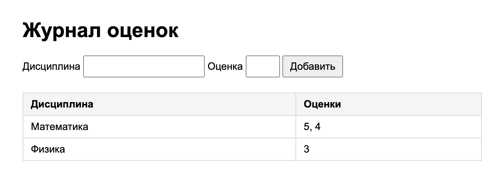](img/task5_browser.png)

Рисунок 12. Журнал после трёх оценок из формы

Запрос POST можно отправить и из терминала. Первая команда передаёт оценку 6 и получает ответ `400 Bad Request`, вторая передаёт оценку 4 и получает ответ `303 See Other`.

```bash
curl -s -i --data-urlencode "discipline=Физика" --data-urlencode "grade=6" \
  http://localhost:8085/ | grep -E "HTTP|<p>"
curl -s -i --data-urlencode "discipline=Физика" --data-urlencode "grade=4" \
  http://localhost:8085/
```

[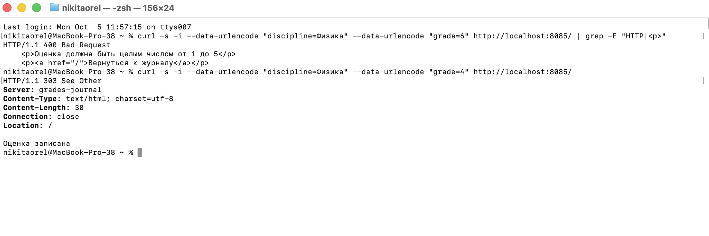](img/task5_curl.png)

Рисунок 13. Ответы сервера на два запроса POST

[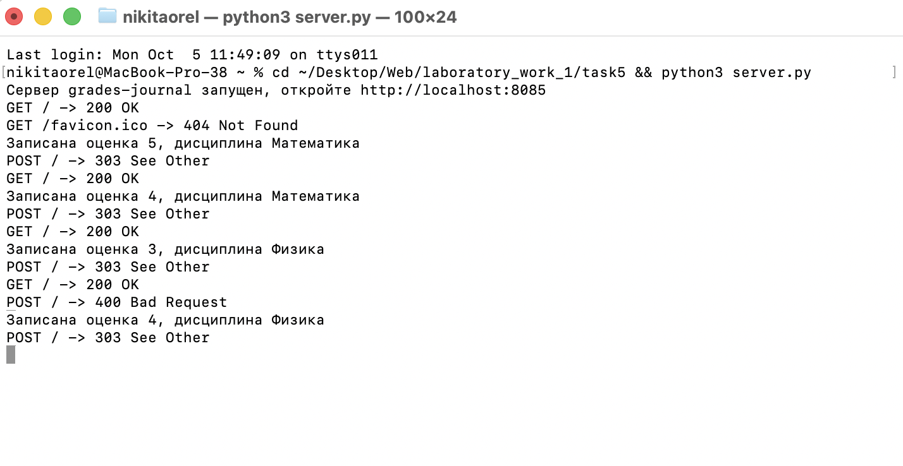](img/task5_server.png)

Рисунок 14. Журнал запросов в окне сервера

После обновления страницы оценка 4 появилась в строке «Физика».

[](img/task5_browser_after_curl.png)

Рисунок 15. Журнал после запроса из curl

## Вывод

В работе реализованы пять программ на сокетах. В задании с UDP обмен свёлся к двум датаграммам без соединения. В TCP границы сообщений пришлось задавать самому, для этого каждое сообщение передаётся отдельной строкой. HTTP оказался текстовым форматом поверх TCP, в котором важно точно собрать строку статуса, заголовки и длину тела в байтах. В чате я разобрался, как обслуживать нескольких клиентов в отдельных потоках и защищать общий словарь блокировкой. В последнем задании сервер сам разбирает запросы GET и POST и хранит оценки сгруппированными по дисциплинам.
